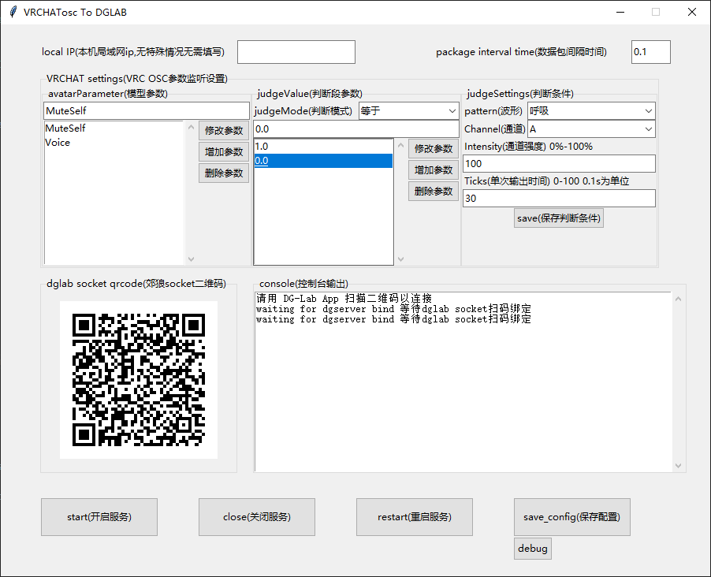

一个简单的监控VRCHAT OSC 参数并想DGLAB 3.0发送控制socket信号的局域网程序。

**请在同一个局域网（wifi）中使用**

请选择好各个参数后再修改第三栏的判断条件，否则不会保存

修改完一个判断段的判断条件后也请点击”保存判断条件“

修改完所有配置后请点击”保存配置“，OSC参数监控服务会自动重启

**不要忘记在保存配置**

如果遇到扫码无法连接可以执行以下操作

- 可以在界面中写自己的IP
- 点击右下角的保存配置
- 右上角点击x关掉程序
- 重新打开程序扫码连接

对于判断模式（针对模型参数的）：

如果一个参数有以下三个判断段

​	[0.1，0.2，0.3]

对应强度是

​	[20，30，40]

当参数为 0.25时，在”大于“判断模式下会触发0.2的 30强度 ，在”小于“判断模式下会触发0.3的40强度

界面样式：

